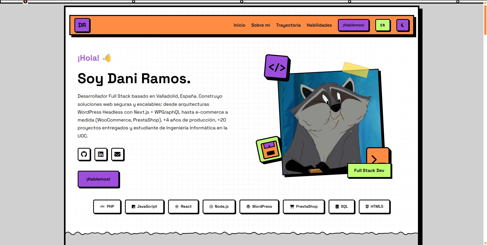

# Portfolio · Dani Ramos Merino

Portfolio personal de **Daniel Ramos Merino**, Desarrollador Full Stack basado en Valladolid, España.

Más de 4 años de experiencia en producción con arquitecturas Headless (WordPress + Next.js + WPGraphQL), e-commerce (WooCommerce, PrestaShop) y stack PHP / TypeScript.

**Live:** [machache.dev](https://machache.dev)

## Stack del sitio

Astro · TypeScript · Tailwind CSS · Leaflet · p5.js

## Contacto

- Web: [machache.dev](https://machache.dev)
- Email: [ramosmerinodaniel@gmail.com](mailto:ramosmerinodaniel@gmail.com)
- LinkedIn: [linkedin.com/in/daniramosmerino](https://www.linkedin.com/in/daniramosmerino/)
- GitHub: [github.com/machachee](https://github.com/machachee)
